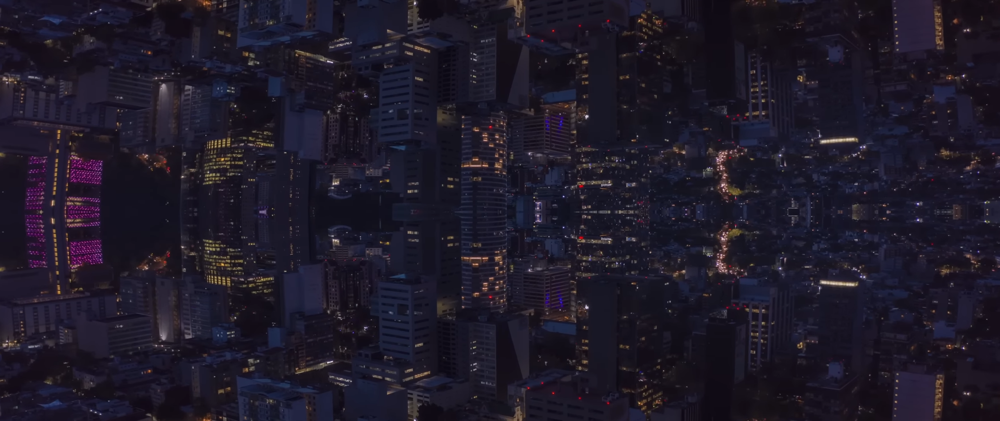

[](https://guns.lol/ghfakegh1337) 


#### *"I'm ready to learn"*

### About Me

🌱 **Currently Learning**: I'm on a journey to learn game hacking and reverse engineering but im still a *newbie*.

## Projects in Progress
```js
urbanmelody:         "[■■■■■ ■■■■■ □□□□□ □□□□□ □□□□□ □□□□□ □□□□□ □□□□□ □□□□□ □□□□□] 15%"
```

## Stats


[]()
[]()

### My workspace


### Social
[](https://guns.lol/ghfakegh1337)
